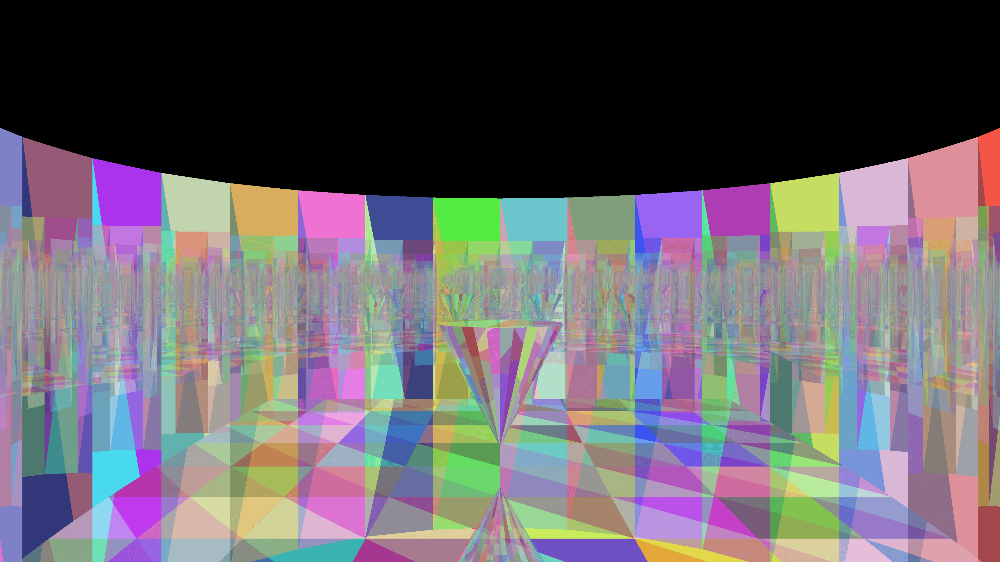

# OpenCL RayTracer

This project utilizes libOpenCL to path trace (without light source calculations however) using the Möller–Trumbore ray-triangle intersection algorithm. It supports up to 20 reflections per ray in the default configuration (you can set it to more, but it will come with a performance penalty). It also uses pseudo-randomized colors for each triangle, so the scene is colorful while always predictable.  
It uses a mesh in the OBJ format as an input, which you can easily make in any CAD program, but don't forget to triangulate the mesh (Control T in blender) before exporting! The OBJ is interpreted as a simple mesh, therefore everything but vertex and face elements will be disregarded.  

## Running
1) Make sure you have opencl setup and working (clinfo should show something like "Number of platforms 1" "Platform Name NVIDIA CUDA" depending on your OpenCL accelerator brand)
2) Compile with `clang++ program2.cpp -lOpenCL -O3`
3) Run with ./a.out (or `time ./a.out` to measure the execution time)
4) Look at the result image (output.ppm) in an image viewer that accepts the Netpbm format of images (e.g., nomacs)

## Example
This image shows the result of a render of the default included OBJ file (Untitled.obj showing a cone in a larger cylinder), and finishes in about 30.5s at 4k on my NVIDIA GTX 1060.  

